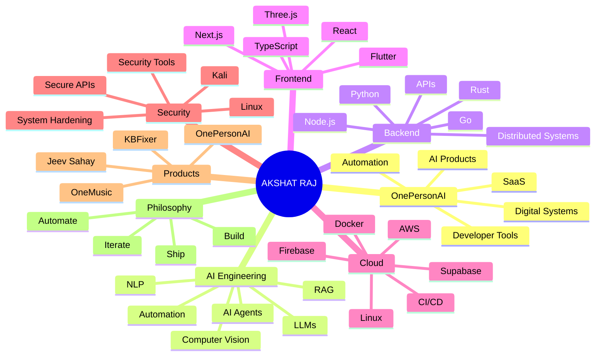
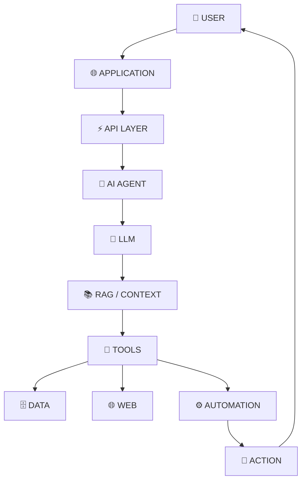
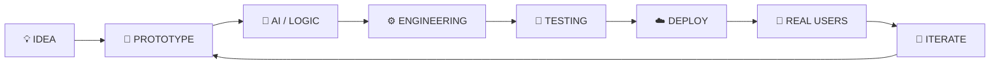
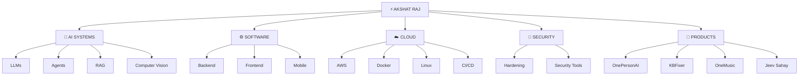

<div align="center">


<br/>


<br/><br/>

<a href="https://onepersonai.in">

</a>
<a href="https://akshat-raj-portfolio-lfy7.vercel.app/">

</a>
<a href="mailto:akshatgyan2004@gmail.com">

</a>

<br/><br/>


</div>

---

<div align="center">

# ⚡ SYSTEM ONLINE


</div>

---

# 🧠 SYSTEM MIND MAP



---


### `IDEA → DESIGN → BUILD → TEST → DEPLOY → MONITOR → ITERATE`

</div>

---

# 🎬 BUILD IN MOTION

<div align="center">


</div>

<br/>

<div align="center">


</div>

---


---

# ⚙️ TECHNOLOGY CORE

<div align="center">

### 🧠 LANGUAGES


<br/><br/>

### 🎨 INTERFACE


<br/><br/>

### ⚡ BACKEND


<br/><br/>

### 🤖 AI / ML


<br/><br/>

### ☁️ CLOUD / DEVOPS


<br/><br/>

### 🗄️ DATA


<br/><br/>

### 🛠️ DEVELOPMENT


</div>

---

# 🧠 INTELLIGENCE STACK



---


---

# 🚀 FEATURED BUILDS

<table>
<tr>

<td width="50%" valign="top">

<div align="center">

## 🧠 OnePersonAI


<br/><br/>

<a href="https://onepersonai.in">

</a>

</div>

</td>

<td width="50%" valign="top">

<div align="center">

## 📄 KBFixer


<br/><br/>

<a href="https://kbfixer.onepersonai.in">

</a>

</div>

</td>

</tr>

<tr>

<td width="50%" valign="top">

<div align="center">

## 🎵 OneMusic


<br/><br/>

<a href="https://github.com/AkshatRaj00">

</a>

</div>

</td>

<td width="50%" valign="top">

<div align="center">

## 🚑 Jeev Sahay


<br/><br/>

<a href="https://jeevsahay.in">

</a>

</div>

</td>

</tr>
</table>

---

# 🔬 PRODUCT PIPELINE



---

# 🌐 DIGITAL SYSTEM MAP



---

# 📡 LIVE BUILD SIGNAL

<div align="center">


<br/><br/>

```
```

</div>

---

# 📊 GITHUB SIGNAL

<div align="center">


<br/><br/>


<br/><br/>


</div>

---

# 🐍 CONTRIBUTION FLOW

<div align="center">


</div>

---


---

# 📡 CONNECT

<div align="center">

<a href="https://github.com/AkshatRaj00">

</a>

<a href="https://akshat-raj-portfolio-lfy7.vercel.app/">

</a>

<a href="https://onepersonai.in">

</a>

<a href="mailto:akshatgyan2004@gmail.com">

</a>

<br/><br/>

<a href="https://x.com/AkshatRaj00_">

</a>

<a href="https://dev.to/akshatraj00">

</a>

<a href="https://www.kaggle.com/akshatraj12">

</a>

<a href="https://nest.owasp.org/members/AkshatRaj00">

</a>

<br/><br/>


<br/><br/>

### ⚡ `ONE PERSON :: FULL STACK :: IDEA → DEPLOY`

</div>

---

<div align="center">


</div>
