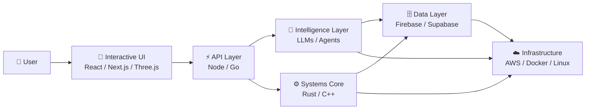

Bilkul yaar 😎 — isko **normal GitHub README** se ekdum **premium developer-portfolio / systems-engineer profile** look dete hain. Dark futuristic theme, terminal-style hero, animated typing, tech matrix, featured projects, GitHub analytics, contribution snake aur clean social section.

**Isse directly `README.md` me replace kar de:**

````markdown
<!-- ========================================================= -->
<!--                    PROFILE HEADER                         -->
<!-- ========================================================= -->

<h1 align="center">
  👋 Hi, I'm <strong>Akshat Raj</strong>
</h1>

<h3 align="center">
  Systems Engineer • AI Builder • Automation Architect • Founder
</h3>

<p align="center">
  <a href="https://onepersonai.in">
    
  </a>
  
  
  
</p>

<p align="center">
  
</p>

<p align="center">
  <a href="https://github.com/AkshatRaj00">
    
  </a>
  <a href="https://github.com/AkshatRaj00?tab=repositories">
    
  </a>
  <a href="mailto:akshatgyan2004@gmail.com">
    
  </a>
</p>

---

<!-- ========================================================= -->
<!--                     SYSTEM STATUS                         -->
<!-- ========================================================= -->

## ⚡ SYSTEM STATUS

```text
┌─────────────────────────────────────────────────────────────┐
│                    ONEPERSONAI SYSTEM                       │
├─────────────────────────────────────────────────────────────┤
│                                                             │
│  Architect        →  Akshat Raj                             │
│  Core System      →  OnePersonAI                            │
│  Architecture    →  Autonomous / Distributed                │
│  Runtime          →  Rust + Go + Python                     │
│  Frontend         →  React + Next.js + Three.js              │
│  AI Layer         →  LLMs + Agents + Automation             │
│  Infrastructure   →  Docker + AWS + Linux                   │
│  Security         →  Defensive / Offensive Research         │
│  Status            →  ████████████████████  ONLINE           │
│                                                             │
└─────────────────────────────────────────────────────────────┘
````

> **"Don't just build software. Build systems that can think, adapt and execute."**

---

## 🧠 ENGINEERING PHILOSOPHY

I build **high-performance software systems, AI-powered automation,
interactive digital experiences and autonomous workflows.**

My focus sits at the intersection of:

```text
        SYSTEMS
           │
           ├───────────────┐
           │               │
        AI / ML         AUTOMATION
           │               │
           └───────┬───────┘
                   │
              DIGITAL
             ECOSYSTEMS
                   │
          ┌────────┴────────┐
          │                 │
       SECURITY          3D / WEB
```

---

# 🛠️ CORE TECHNOLOGY MATRIX

### ⚙️ Systems & Performance

<p align="center">
  
</p>

**Rust • Go • C++ • C • Python • Linux**

---

### 🌐 Full-Stack Engineering

<p align="center">
  
</p>

**TypeScript • JavaScript • React • Next.js • Node.js • Express • PHP • Laravel**

---

### 🎨 3D / Interactive Web

<p align="center">
  
</p>

**Three.js • WebGL • Custom Shaders • Interactive UI • 3D Experiences**

---

### 🤖 AI / Agents / Automation

```text
LLMs
 │
 ├── AI Agents
 │
 ├── Autonomous Workflows
 │
 ├── Intelligent Automation
 │
 ├── API Orchestration
 │
 └── Python Daemons
```

**OpenAI APIs • LangChain • AI Agents • Custom Workflows • Automation**

---

### ☁️ Cloud / DevOps / Infrastructure

<p align="center">
  
</p>

**AWS • Docker • Linux • Git • GitHub Actions • Firebase • Supabase**

---

# 🚀 FEATURED SYSTEMS

<table>
<tr>

<td width="50%" valign="top">

## 🧠 OnePersonAI

**Autonomous Digital Ecosystem**

A technology platform focused on AI,
automation, digital products and intelligent
software systems.

**Stack**

```text
Next.js
Node.js
AI APIs
Automation
Cloud Infrastructure
```

🌐 **Platform**

[https://onepersonai.in](https://onepersonai.in)

</td>

<td width="50%" valign="top">

## 📄 KBFixer

**High-Performance Document Engine**

A web-based system designed for efficient
PDF and presentation processing with a focus
on speed and usability.

**Stack**

```text
Next.js
TypeScript
Web APIs
Document Processing
```

🌐 **Platform**

[https://kbfixer.onepersonai.in](https://kbfixer.onepersonai.in)

</td>

</tr>

<tr>

<td width="50%" valign="top">

## 🎵 OneMusic

**Open Music Streaming Platform**

A Flutter-based music application focused
on a clean, fast and modern listening
experience.

**Stack**

```text
Flutter
Dart
Android
Firebase
```

🔗 **Repository**

[https://github.com/AkshatRaj00](https://github.com/AkshatRaj00)

</td>

<td width="50%" valign="top">

## 🚑 Jeev Sahay

**Intelligent Emergency Assistance**

A digital platform designed around emergency
assistance, accessibility and intelligent
support workflows.

**Stack**

```text
Next.js
Tailwind CSS
APIs
AI Workflows
```

🌐 **Platform**

[https://jeevsahay.in](https://jeevsahay.in)

</td>

</tr>
</table>

---

# 🧬 ARCHITECTURE MINDSET



---

# 📊 GITHUB INTELLIGENCE

<p align="center">
  
  
</p>

<p align="center">
  
</p>

---

# 🐍 CONTRIBUTION EXECUTION TRACE

<p align="center">
  <picture>
    <source
      media="(prefers-color-scheme: dark)"
      srcset="https://raw.githubusercontent.com/AkshatRaj00/AkshatRaj00/output/github-contribution-grid-snake-dark.svg"
    />
    <source
      media="(prefers-color-scheme: light)"
      srcset="https://raw.githubusercontent.com/AkshatRaj00/AkshatRaj00/output/github-contribution-grid-snake.svg"
    />
    
  </picture>
</p>

---

# 🌐 DIGITAL ECOSYSTEM

<p align="center">

<a href="https://github.com/AkshatRaj00">

</a>

<a href="https://akshat-raj-portfolio-lfy7.vercel.app/">

</a>

<a href="https://www.kaggle.com/akshatraj12">

</a>

<a href="https://dev.to/akshatraj00">

</a>

<a href="https://akshatraj00.medium.com/">

</a>

<a href="https://x.com/AkshatRaj00_">

</a>

<a href="https://www.reddit.com/user/AkshatRaj00_/">

</a>

</p>

---

# 🏗️ CURRENTLY BUILDING

```text
[████████████████████████████████] 100%

✓ Autonomous AI Workflows
✓ High-Performance Backend Systems
✓ 3D Interactive Interfaces
✓ Developer Automation
✓ Cloud-Native Infrastructure
✓ Security Engineering
✓ Open-Source Projects
```

---

# 🔥 ENGINEERING INTERESTS

```text
01. Distributed Systems
02. Artificial Intelligence
03. Autonomous Agents
04. Systems Programming
05. High-Performance Computing
06. Cybersecurity
07. 3D Web Experiences
08. Developer Infrastructure
09. Cloud Architecture
10. Automation
```

---

# 📡 CONNECT

<p align="center">

<a href="mailto:akshatgyan2004@gmail.com">

</a>

</p>

<p align="center">
  <i>Engineering the future, one system at a time.</i>
</p>

<p align="center">
  
</p>
```

### 🔥 Ek important correction

Tere original README mein `Dynamic Neural & 3D Interactive Architecture` ke baad JSON code fence close nahi hua tha. Maine usko proper structure mein fix kar diya hai.

Aur **ek cheez main strongly recommend karunga**: GitHub profile ko aur premium banane ke liye `OnePersonAI`, `KBFixer`, `OneMusic`, etc. ke liye **actual project cards + live status + tech badges + screenshots** add karna. Tab profile simple README nahi, ek **proper engineering portfolio landing page** jaisa lagega.
